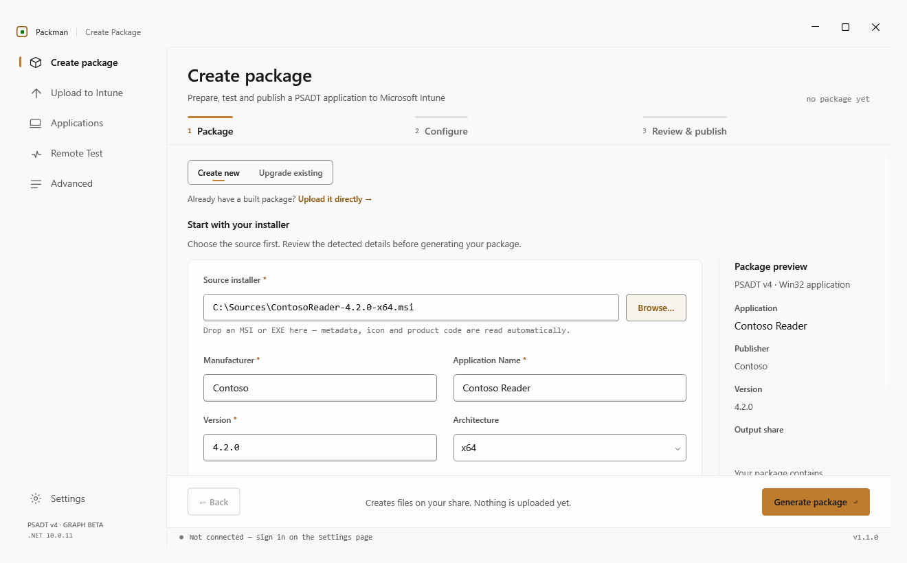
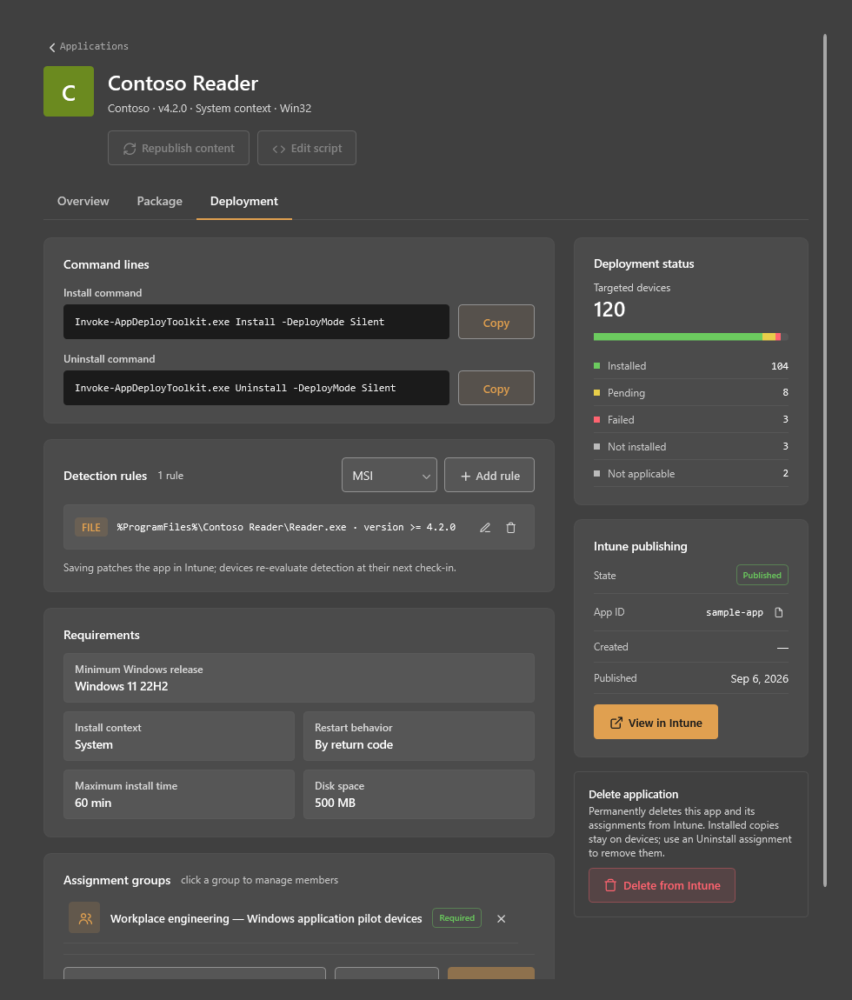

# PACKMAN

A Windows desktop app for packaging Win32 applications with the **PowerShell App
Deployment Toolkit (PSADT) v4** and publishing them to **Microsoft Intune**.

Point Packman at an installer (MSI or EXE). It reads the file's metadata, wraps it in a PSADT v4
package on your share, lets you edit the deploy script, test the install on a real machine, builds
the `.intunewin`, and publishes it to your tenant over Microsoft Graph — detection rules,
requirements, return codes, group assignment, code signing and supersedence included.

**Community edition · Apache 2.0 · Windows / .NET 10**

In a hurry? **[HOWTO.md](HOWTO.md)** is the five-step quick start. See [Contributing](CONTRIBUTING.md),
[the Community / Pro roadmap](ROADMAP.md) and [private security reporting](SECURITY.md).
Existing packaging and Intune workflows stay in the free community edition. Key Vault authentication,
WDAC catalog generation and GitLab pipelines are planned commercial integrations.



<details>
<summary>Application deployment in the dark theme</summary>



</details>

These are native Windows CI renders with sample data; they do not show a live tenant deployment.

---

## Contents

- [Feature list](#feature-list)
- [Requirements](#requirements)
- [Build and run](#build-and-run)
- [First-run setup — the Settings page](#first-run-setup--the-settings-page)
- [Creating a package](#creating-a-package)
- [Editing the deploy script](#editing-the-deploy-script)
- [Remote testing](#remote-testing)
- [Publishing to Intune](#publishing-to-intune)
- [Upgrading a package to a new version](#upgrading-a-package-to-a-new-version)
- [Upload to Intune (standalone)](#upload-to-intune-standalone)
- [Applications — browsing your tenant](#applications--browsing-your-tenant)
- [Advanced — directory tools](#advanced--directory-tools)
- [Where things live on disk](#where-things-live-on-disk)
- [What Packman cannot do](#what-packman-cannot-do)
- [Troubleshooting](#troubleshooting)
- [Project layout](#project-layout)
- [License](#license)

---

## Feature list

### Packaging

- Create a PSADT v4 package from an **MSI** or **EXE** — browse or drag-and-drop the file.
- **Metadata read straight out of the installer**: app name, manufacturer, version and the app
  icon; plus MSI product code, product version and upgrade code for an MSI. Fields are editable before generation; afterward, **Start a new package** resets the form.
  Packman fills in empty fields without replacing your edits.
- **Architecture** (x64 / x86) and **install context** (SYSTEM / USER) written into the script
  (`AppArch`, `RequireAdmin`).
- Script metadata rewritten automatically: vendor, name, version, arch, script date, author.
- Install/uninstall calls injected into the right PSADT sections — `Start-ADTMsiProcess` for an
  MSI, `Start-ADTProcess` with `<silent flags>` / `<uninstall flags>` placeholders for an EXE.
- A fixed package layout per version: `Application/`, `Intune/`, `Icon/`.
- Replace-or-cancel prompt when the version folder already exists.
- **Upgrade** an existing package to a new version — the old package is copied forward (keeping
  your script edits), the new installer swapped in, metadata refreshed, and an Intune
  **supersedence** relationship written on upload.

### Script editing

- **Built-in Monaco editor** (WebView2) with a package file tree, tabs, dirty markers and
  Ctrl+S save.
- **PSADT v4 IntelliSense** — completions, hover documentation and signature help driven by the
  bundled function catalog (`PSADT_v4_Functions*.csv`).
- **PowerShell syntax checking** as you type (parse only — nothing in the script is executed);
  errors are underlined and counted in the status bar.
- Search across the package by **file name and file contents**, jumping straight to the line.
- Detects files **changed on disk** outside Packman, with reload / revert.
- Encoding, EOL, language, cursor and selection shown in the status bar.
- **Open in VS Code** (or PowerShell ISE, or the default handler) for anything you would rather
  do in your own editor.
- Unsaved work is prompted for on app close.

### Testing

- **Remote test** a package on a real machine over WinRM before anything reaches Intune.
- Runs as **NT AUTHORITY\SYSTEM** (what the Intune Management Extension does) or in the
  **logged-on user's** session, via a one-shot scheduled task.
- Live PSADT console output, colour-coded, with copy progress while the package is staged.
- **Install**, **Uninstall**; exit codes `0` / `3010` / `1641` treated as success.
- Optional cleanup of the staged copy on the target after each run.
- Recent target machines remembered (last 8), with a **Ping** action.
- **Detection-rule discovery** — after a successful install Packman searches the target for the
  executable that was actually installed and proposes a file/version rule, which can be pushed
  straight into the publish step.

### Publishing

- Builds the `.intunewin` with Microsoft's `IntuneWinAppUtil.exe`.
- Optional **Authenticode code signing** of package files, in-process, using a certificate from
  the Windows store (no temporary PFX on disk), with a configurable timestamp server.
- Creates the Win32 LOB app in Intune, uploads the encrypted content to Azure blob storage and
  commits it, with a five-stage progress overlay.
- **Detection rules**: file exists, file version, registry key, MSI product code.
- **Install/uninstall command lines** from your defaults, with a **PSADT deploy mode** picker
  (Auto / Interactive / NonInteractive / Silent) that appends `-DeployMode` and previews the
  resulting command.
- **Requirements** (minimum OS, disk, memory, processors, CPU speed) and **return codes**.
- Custom **display name** per app, from a token template.
- Privacy and information URLs for Company Portal.
- App **icon** taken from the installer.
- **Group assignment** to Entra security groups with a per-group intent (Required / Available /
  Uninstall), searched live from Entra.
- Optional **per-package groups** — an install group and/or an uninstall group created (or
  reused) from a name template on every upload.
- **Cancel** mid-upload: cleanup is attempted for a known incomplete app; confirmed or uncertain publication retains the app for review.
- A per-upload **log file**, and a **marker file** in the package folder recording the Intune App ID.

### Tenant management

- **Applications** — browse the Win32 apps in your tenant with search, category / manufacturer /
  last-updated filters, sortable columns and paging.
- **Application detail** — metadata, install and uninstall command lines, requirements,
  publishing state, deployment status rollup (installed / pending / failed / not installed /
  not applicable) and a link into the Intune admin center.
- **Package source check** — locates the package on your share and verifies the deploy script,
  the `.intunewin` (size compared against Intune), `detection.xml` and the icon.
- **Edit detection rules** on a published app (add, edit, delete) and PATCH them back.
- **Edit assignments** on a published app — add or remove groups.
- **Group membership** slide-over: list members, search devices and users, add and remove them.
- **Delete** an app from the tenant, with an explicit confirmation. Deleting the Intune record does not uninstall copies on devices.
- **Advanced** directory tools: bulk-add PCs to a group, list a PC's groups, and list every app
  targeting a group.

### Application-wide

- Interactive (browser) sign-in or app-registration + certificate sign-in via MSAL, with the
  Windows broker.
- **Test connection** — probes Graph read access and reports service errors; write permissions still need the documented consent and roles.
- Dark / Light / System theme, applied and remembered immediately.
- Crash and error logging to disk; a failed background task reports rather than killing the app.

---

## Requirements

| | |
|---|---|
| **OS** | Windows (WPF, Windows certificate store, WinRM client) |
| **Runtime** | .NET 10 Desktop Runtime — or the .NET 10 SDK to build |
| **Editor host** | Microsoft Edge **WebView2 Runtime** (for the in-app script editor; without it the editor falls back to "open in VS Code") |
| **PSADT v4 template** | A folder holding `Invoke-AppDeployToolkit.ps1` **plus the runtime** (`Invoke-AppDeployToolkit.exe` and the `PSAppDeployToolkit` module). A script-only starter ships in `Packman/PSADT/` — see `Packman/PSADT/README.md` |
| **Content prep tool** | `IntuneWinAppUtil.exe` (Microsoft Win32 Content Prep Tool) |
| **Tenant** | An active Microsoft Intune license and Microsoft Graph permissions for the selected [authentication mode](#authentication) |
| **Remote test (optional)** | A test machine with WinRM enabled and reachable, and administrative rights on it (the package is staged over the `C$` admin share) |

## Build and run

Successful [Windows CI runs](https://github.com/TechLakeRS/Packman/actions/workflows/build.yml)
provide a **Packman-community-windows** artifact. Extract the entire archive and launch
`Packman.exe` after installing the runtimes listed under Requirements. CI artifacts are development builds,
not a separately signed installer or stable release. The complete PSADT runtime and
IntuneWinAppUtil still need to be configured in Settings.

```bash
git clone https://github.com/TechLakeRS/Packman.git
cd Packman
```

```bash
dotnet build Packman.sln
```

```bash
dotnet run --project Packman/Packman.csproj
```

Or open `Packman.sln` in a Visual Studio installation with .NET 10 support and run.

Windows CI builds and launches the packaged app, then exports native view previews in both themes.
The standalone preview utility uses sample data and does not deploy anything:

```powershell
dotnet run --file scripts/RenderUiPreviews.cs -c Release -- artifacts/ui-previews
```

The solution contains only the desktop application; no separate test project is required.

## Offline builds

`NuGet.config` at the repo root points restore at `packages/`, a folder of `.nupkg`
files checked into the repo — the project's full dependency closure, transitive
packages included. The config opens with `<clear />`, so restore ignores nuget.org and
any feed configured on the machine. A fresh clone builds and runs with no network
access.

The .NET 10 SDK and the WebView2 Runtime from **Requirements** above still have to be
installed on the machine; neither ships as a NuGet package.

### Publishing offline

`packages/` also carries the `win-x64` runtime packs, so both publish modes work with
no network:

```bash
dotnet publish Packman/Packman.csproj -r win-x64 --self-contained false -c Release
```

```bash
dotnet publish Packman/Packman.csproj -r win-x64 --self-contained true -c Release
```

Self-contained produces a ~170 MB folder that needs no .NET install on the target. It
pulls in the ASP.NET Core runtime pack as well as the desktop one, because
`System.Management.Automation` carries a framework reference to `Microsoft.AspNetCore.App`.

Only `win-x64` is vendored. Another RID (`win-arm64`, `win-x86`) means re-vendoring
with that RID in the restore command below.

### Adding or updating a package

Do it somewhere with internet, then re-vendor:

```powershell
$feed = "https://api.nuget.org/v3/index.json"
dotnet restore Packman.sln --source $feed --packages .\obj\pkgstage
dotnet restore Packman\Packman.csproj -r win-x64 --source $feed --packages .\obj\pkgstage
Get-ChildItem .\obj\pkgstage -Recurse -Filter *.nupkg | Copy-Item -Destination .\packages
```

`--source` bypasses the offline config for those commands. The second restore is what
picks up the runtime packs — skip it and publishing breaks offline while building still
works, which is an easy thing not to notice.

Commit the new `.nupkg` files together with the `.csproj` change, then confirm the
result still works with no network:

```bash
dotnet restore Packman.sln --force
```

---

## First-run setup — the Settings page

Settings has six live sections in the left rail. **Authentication** and **Network Paths** are the
two you must complete; the rest have working defaults. Press **Save** when done — except
Appearance, which applies and saves immediately.

### Authentication

Two modes:

- **Interactive** (default) — press **Sign in** and complete the Microsoft prompt. No app
  registration needed: Packman uses the public *Microsoft Graph Command Line Tools* client, which
  exists in virtually every tenant. Set a **Tenant ID** to pin sign-in to one tenant, or leave it
  blank for `organizations`.
- **App Registration** — enter **Tenant ID** and **Application (Client) ID**, then pick the
  authentication **certificate** from the `CurrentUser\My` store or paste its thumbprint. The
  registration needs application permissions and admin consent as listed below.

Graph permissions for the available features:

- **Interactive (delegated):** `User.Read`, `DeviceManagementApps.ReadWrite.All`,
  `Group.ReadWrite.All`, `User.ReadBasic.All`, `Device.Read.All`, and `GroupMember.ReadWrite.All`.
- **App Registration (application):** `DeviceManagementApps.ReadWrite.All`,
  `Group.ReadWrite.All`, `User.ReadBasic.All`, and `GroupMember.ReadWrite.All`.
  Use `Device.ReadWrite.All` to add devices to groups; `Device.Read.All` suffices for device
  lookup if device membership changes are not used. `User.Read` is a delegated permission.

Group changes in interactive mode also require a supported Entra role or group ownership;
Intune operations remain subject to tenant permissions. Microsoft's
[add-member contract](https://learn.microsoft.com/en-us/graph/api/group-post-members?view=graph-rest-beta)
lists the different delegated and application permissions and supported roles.

**Test connection** reads apps, groups, devices and users and reports each read check separately.
Passing these checks does not verify write permissions or administrator roles for publishing and
group changes. The footer status dot turns green and reads
*Connected to Microsoft Intune · you@tenant* once signed in.

### Code Signing (optional)

Enable to Authenticode-sign the package files before the `.intunewin` is built. Pick the signing
certificate from the store (or enter a thumbprint) and a **timestamp server** (defaults to
DigiCert). Signing runs in-process — no temporary PFX is written. If signing is enabled and the
certificate or signing operation fails, publishing stops before building or uploading content.

### Network Paths

| Setting | What it is |
|---|---|
| **Intune Applications Path** | Root folder where packages are written, typically a share. |
| **PSADT Template Path** | Your PSADT v4 folder — either the folder containing `Invoke-AppDeployToolkit.ps1` or the script path itself. |
| **IntuneWinAppUtil Path** | Full path to `IntuneWinAppUtil.exe`. |

Package generation is blocked until the first two are set; upload is blocked until the third is.

### Group Assignment

Defaults applied to every upload started from the **Create Package** wizard:

- **Create an install group for each package** — auto-create (or reuse) an Entra security group
  named from a template, with a chosen intent (Available / Required). Tokens: `%vendor%`,
  `%appName%`, `%appVersion%`. A live preview shows how the name resolves.
- **Create an uninstall group for each package** — same, always assigned with the *Uninstall* intent.
- **Always assign these existing groups** — a list of group names, each with its own intent. These
  pre-fill the assignment picker on the wizard's Configure step, where you can still edit them per
  package.

### Intune Defaults

- **Install / uninstall command lines** (default `Invoke-AppDeployToolkit.exe Install` / `Uninstall`).
- **Display name template** for the app title in Intune — same `%vendor%` / `%appName%` /
  `%appVersion%` tokens, with a preview.
- **Requirements**: minimum OS, free disk space, memory, processors, CPU speed.
- **Return codes**: the Intune success/retry/failure mapping, with restore-to-defaults.
- **Privacy** and **information URLs** for Company Portal (sent only when set).

### Appearance

Dark (default), Light, or System (follows the Windows app theme). Applied and saved on change.

Only implemented settings are shown. Appearance saves immediately; other changes use **Save settings**. Save and error feedback stays below the settings content.

---

## Creating a package

**Create Package** in the sidebar runs a three-step wizard — **Package → Configure → Review & publish** — with
two optional side trips (Edit Script, Remote Test) available from the Package step. `↵` triggers
the primary button; **← Back** steps back.

### Step 1 — Package

1. Leave the mode toggle on **Create new**.

2. **Pick the source installer.** Press **BROWSE**, or drag an MSI/EXE straight onto the Sources
   Path field. What happens next depends on the file type:

   | You select | Packman reads | Fields it fills |
   |---|---|---|
   | **.msi** | The MSI property table (`ProductName`, `Manufacturer`, `ProductVersion`, `ProductCode`, `UpgradeCode`) | App Name, Manufacturer, Version — and it remembers the **product code**, which later becomes the default detection rule |
   | **.exe** | The file's version resource (product name, company, file version) | App Name, Manufacturer, Version — whatever the resource actually contains |
   | **either** | The embedded application icon | The icon shown on the card, archived into the package and uploaded to Intune with the app |

   If the EXE has no usable metadata, the app name falls back to a cleaned-up version of the file
   name. Only **empty** fields are filled — anything you already typed is left alone, so you can
   type the name first and drop the file second.

3. **Fix up the details yourself.** Manufacturer, Application Name, Version and Architecture
   (x64 / x86) are all plain editable fields. Nothing here is locked: installer metadata is often
   wrong or ugly ("Acme Reader (x64) 24.1 MUI"), and what you type is what ends up in the script,
   in the folder name and — through the display-name template — in the app title in Intune.

4. **Pick the Install Context.** This is written into the script as `RequireAdmin`:

   - **SYSTEM** — installs for all users, elevated. The usual choice for managed apps.
   - **USER** — installs for the current user only, without elevation.

5. Press **Generate package**.

**What generation actually does.** Packman copies your PSADT template into

```
<Intune Applications Path>\<Vendor>_<AppName>\<Version>\
    Application\      <- the PSADT template; your installer lands in Application\Files\
    Intune\           <- the .intunewin is built here at upload time
    Icon\             <- the icon extracted from the installer
```

then rewrites `Invoke-AppDeployToolkit.ps1` — `AppVendor`, `AppName`, `AppVersion`, `AppArch`,
`AppScriptDate`, `AppScriptAuthor`, `RequireAdmin` — and injects the deployment calls:

- **MSI** → `Start-ADTMsiProcess -Action 'Install' -FilePath "$($adtSession.DirFiles)\your.msi"`,
  and an uninstall by **product code**. Usually ready to run as generated.
- **EXE** → `Start-ADTProcess -FilePath "$($adtSession.DirFiles)\setup.exe" -ArgumentList
  '<silent flags>'`, and the same for uninstall with `'<uninstall flags>'`. **You must replace
  those two placeholders** in the editor — they are literal text, not real switches.

If that version folder already exists you are asked whether to **replace** it; declining cancels
without touching anything.

Once a package exists, the **Prepare for deployment** card offers three optional actions — **Edit
script**, **Remote test**, **Open folder** — and the primary button becomes **Continue to configure**.

---

## Editing the deploy script

**Edit script** opens the package in the built-in editor. It is optional — but for an EXE package
it is where you replace `<silent flags>` and `<uninstall flags>` with the installer's real switches.

- The left rail shows the package file tree; the search box searches **file names and contents**
  and jumps to the matching line.
- Open files become tabs. A dot on a tab means unsaved changes. **Save** (or Ctrl+S) writes to the
  package on the share, preserving the file's original encoding and line endings.
- PowerShell files get **PSADT v4 completions, hover documentation and signature help** from the
  bundled catalog, plus **live syntax checking** — the problem count sits in the status bar and
  errors are underlined. The check only parses; it never runs the script.
- If a file changes on disk while it is open, a **Changed on disk — reload** button appears.
  **Revert** throws away your buffer and re-reads the file.
- **OPEN IN VS CODE** (footer) opens the active file — or the deploy script — in VS Code,
  PowerShell ISE, or the system default, in that order of preference.
- **← Back to package** returns to the wizard; **Continue to upload** goes straight on.

If the WebView2 Runtime is missing the editor is replaced by a note and the VS Code path.

---

## Remote testing

**Remote test** stages the package on a machine and runs it there, so you see the real install
before Intune ever sees the package. It is optional.

WinRM is only the transport — the install itself runs from a one-shot **scheduled task**, because a
remote session runs as the connecting admin and would not match Intune's identity.

1. **Package** — pre-filled with the package the wizard just generated. On the standalone
   **Remote Test** page (sidebar) there is no wizard package, so **Browse for package** and pick one
   built earlier; name and version are read back out of its script.
2. **Computer Name** — type it or pick a recent one, then **Ping** to check reachability.
3. **Run Context**:
   - **SYSTEM** (default) — runs as `NT AUTHORITY\SYSTEM`, the identity the Intune Management
     Extension uses for a System-context deployment. SYSTEM has a different `%TEMP%` and
     HKCU, and reaches network shares as the *machine* account, so a package that works under your
     own login can still fail here.
   - **USER** — runs in the logged-on user's session, so their profile and HKCU apply and the PSADT
     dialogs can be visible when the deployment mode permits interaction. Somebody must be logged on.
   Choose the context that matches the app’s configured Intune install behavior.
4. Optionally tick **Delete the staged package from the target after the run** (off by default, so
   a re-run only copies what changed). The setting is remembered.
5. **Run install** copies the package to `C:\Temp\Packman\...` over the admin share, registers the
   task, and streams PSADT's output into the console. **Run uninstall** does the same with
   `-DeploymentType Uninstall`.
6. After a successful install Packman waits for the registry to settle and searches the target for
   the executable that was installed, proposing a **detection rule** from its real path and
   version. **Discover detection rule** re-runs that search on its own.
7. **Use for publishing** pushes that rule into the wizard's Configure step. This is only available for
   the wizard's own package — a package picked from the share has no publish step to feed.

Exit codes `0`, `3010` and `1641` count as success (the latter two mean *reboot required*).

---

## Publishing to Intune

### Step 2 — Configure

**Nothing is sent to Intune from this step.** It is where you decide how the app will land, and
every field here is pre-filled from Settings and then editable for this one package.

1. **Name in Intune** — built from the display-name template in Settings
   (`%vendor% %appName% %appVersion%` by default). This is the title users and admins see; edit it
   freely, it does not change the folder or the script.

2. **Detection method** — how Intune decides the app is installed. One rule, one of four kinds:

   | Method | You supply | Pre-filled when |
   |---|---|---|
   | **MSI product code** | product code | the package contains an MSI — Packman reads the code off it and selects this method automatically |
   | **File exists** | path + file or folder name | — |
   | **File version** | path + file name + version to compare (`>=`) | non-MSI packages: the version is pre-filled from the package, the path is yours to supply |
   | **Registry key** | hive + key path + optional value name | — |

   If you ran a remote test, **Use for publishing** will have filled a file/version rule in from the
   real install. Packman refuses to upload an incomplete rule — Intune would accept it and then
   never detect the app, so a Required assignment would reinstall forever.

3. **PSADT deploy mode** — how `Invoke-AppDeployToolkit.exe` runs on the device:

   | Mode | Behaviour |
   |---|---|
   | **Auto** (default) | PSADT chooses from session state and toolkit configuration; behavior depends on the PSADT version. |
   | **Interactive** | For attended testing; do not rely on user interaction during an Intune installation. |
   | **NonInteractive** | Does not wait for user input; progress may be shown when a suitable user session exists. |
   | **Silent** | No dialogs at all. |

   Anything other than *Auto* appends `-DeployMode <mode>` to **both** command lines; the result is
   previewed under the picker. A command that already sets `-DeployMode` in Settings is used as
   written.

4. **Requirements & return codes** — minimum OS, disk, memory, processors, CPU speed, and the
   success/retry/failure return-code map. Pre-filled from Settings ▸ Intune Defaults, editable per
   package, with **restore defaults**.

5. **Assignments** — who gets the app. Pre-filled with the groups from
   Settings ▸ Group Assignment (each resolved against Entra when the step opens). To change it:
   pick an intent — **Required** (installs it), **Available** (offers it in Company Portal) or
   **Uninstall** (removes it) — type at least part of a group name, and click a result to add it as
   a chip. Each row keeps **its own** intent, so one package can push to a pilot group as Required,
   offer itself to a wider group as Available, and remove itself from a third, all in one upload.
   Remove any row you do not want for this package. A default group that no longer exists in Entra
   is shown but skipped, with a note saying so.

### Step 3 — Review & publish

Everything you chose, read-only, in one place: destination tenant, package metadata, source size, deploy mode, command lines, detection, requirements, return codes and assignments. Per-package groups that will be created or reused are listed separately. **Edit package**, **Configure**, and **Open remote test** return directly to the relevant task. Check it, confirm you are signed in
and that the IntuneWinAppUtil path is set, then press **Build & publish**.

Before signing or building, Packman checks the staged `Application/` folder for the PSADT script, launcher and module manifest. It parses the script without executing it and blocks syntax errors and the generated EXE `<silent flags>` / `<uninstall flags>` placeholders. This is a preflight check, not proof that the installer works: test both installation and removal on a representative device.

Use **Silent** for unattended Intune deployment. Microsoft's Win32 guidance requires installation without user interaction. PSADT Auto behavior also depends on toolkit version and configuration; see [Microsoft's Win32 app guidance](https://learn.microsoft.com/en-us/intune/app-management/deployment/add-win32) and [PSADT deployment modes](https://psappdeploytoolkit.com/docs/explanation/deployment-modes).

**What upload actually does**, with a shared five-stage progress panel:

1. **Signs** the deploy script, if code signing is enabled in Settings.
2. **Builds** the `.intunewin` into the package's `Intune` folder using `IntuneWinAppUtil.exe`.
3. **Registers** the Win32 app in your tenant with your detection rule, install/uninstall command
   lines, requirements, return codes, install context, icon, and the privacy/information URLs.
4. **Uploads** the encrypted content to Azure blob storage, streamed straight out of the
   `.intunewin`, and commits it.
5. **Publishes** the app and **assigns** the groups listed on the Review step — and, if those
   options are on in Settings, creates (or reuses) the per-package **install group** and
   **uninstall group** from their name templates and assigns those too.

Before publication, cancelling attempts to remove a known half-created app; the result line
reports cleanup success or failure. If no app ID was confirmed, check Intune before retrying.

On success the status reads **Uploaded to Intune · App ID …**, a marker file recording the App ID is
written into the package folder, and — if the package came from the upgrade flow — a
**supersedence** relationship is written marking the previous app as superseded by this one.

Packman waits for Intune to report the app as published before assigning groups. If final
publication is uncertain, or later assignment or supersedence work fails or is cancelled,
Packman retains the app and shows its ID with a warning. Review its content, publishing state
and assignments in Intune before creating another copy; a lost response does not prove that
the change failed.

---

## Upgrading a package to a new version

From **Create Package**, switch the mode toggle to **Upgrade existing**:

1. **BROWSE** to the existing package folder. Packman reads its vendor, name, version and install
   context back out of the script.
2. Select the **new source installer**; the new version is auto-filled from its metadata (edit it if
   you disagree).
3. Press **Upgrade package**.

The old package is copied forward — **keeping your script edits** — the new installer replaces the
old one under `Files\`, the script metadata and MSI product code are refreshed, and the icon is
carried over. The wizard then continues exactly as for a new package; on upload the previous app
(identified by the marker file in the old package folder) is marked as superseded.

Unlike Create, an upgrade **fails** rather than prompting if the target version folder already
exists — delete it or pick a different version.

---

## Upload to Intune (standalone)

**Upload to Intune** in the sidebar publishes a package that already exists on disk, without going
through the wizard:

1. Select the package folder (the one containing `Application\`). Packman checks for
   `Invoke-AppDeployToolkit.exe` and the deploy script, then reads the metadata and install context
   back out of the script.
2. Edit the **Name in Intune** if needed.
3. Review the **detection rules** — a product-code rule is proposed from a staged MSI. Unlike the
   wizard you can add **several** rules here (File / Registry / MSI); Intune requires all of them
   to match, and the upload refuses to start with none.
4. Search and add **Entra groups**, each with an intent.
5. Press **Upload**. The same five-stage overlay as the wizard tracks the publish and can be
   cancelled.

This page uses the install/uninstall command lines, requirements and return codes from Settings as
they are — there is no deploy-mode picker and no icon upload.

---

## Applications — browsing your tenant

**Applications** lists the **Win32 LOB apps** in your tenant. It requires being signed in; if you
are not, the page offers a link to Settings instead. The list is fetched once and cached for the
session — **Refresh** forces a re-fetch, and it reports progress while paging through Graph.

### Navigating the list

- **Search** matches the display name and publisher.
- **Category**, **Manufacturer** and **Updated** (any time / 7 / 30 / 90 days) filters. The category
  and manufacturer lists are built from the apps actually returned.
- Click the **APPLICATION** or **UPDATED** column header to sort; click again to flip direction.
  The default is newest-updated first.
- **50 apps per page**, with previous/next and a "showing X–Y of Z" readout. Changing any filter
  resets you to page 1.
- A row whose publishing state is not *published* carries a pill — *Processing…* or *Upload
  incomplete*.
- Click a row to open its detail; the breadcrumb takes you back.

### Application detail

The header carries **Republish content** and **Edit script**. The sidebar has **View in Intune**,
the App ID with a copy action, and **Delete from Intune**. Three tabs:

**Overview** — publisher, version, category, package type, size, dates, publishing state,
description, and the current assignments (read-only here; *Manage in Deployment* jumps to the tab
that edits them).

**Package** — where the app lives on your share. Packman searches the Intune Applications path for a
matching `<Vendor>_<AppName>\<Version>` folder and runs an integrity check:

| Check | Meaning |
|---|---|
| `Invoke-AppDeployToolkit.ps1` | deploy script present |
| `*.intunewin` | present, and its size compared against what Intune reports (10% tolerance for encryption overhead) |
| `detection.xml` | detection definition present |
| `Icon\…` | icon archived with the package |

From here you can **copy the path**, **open the folder**, or **edit the script** in VS Code / ISE.

**Deployment** — **install and uninstall command lines** (with copy buttons), editable
**detection rules**, requirements and assignment groups. The detection editor supports:

- **Add rule** — MSI, File or Registry.
- Inline edit of path, file/folder or value name, detection type (exists, does not exist, version,
  string, integer, size in MB, modified date), operator and value.
- Delete a rule, with a warning that removing the last matching rule makes Intune think the app is
  not installed and reinstall it on Required assignments.
- Saving PATCHes the whole rule array back to Intune; devices re-evaluate at their next check-in.
- **PowerShell script** detection rules are shown but cannot be edited in Packman.

Requirements show install context, restart behavior, maximum install time and disk space.
The sidebar shows the deployment rollup: targeted devices with an installed / pending / failed
bar plus not-installed and not-applicable counts. Assignment actions include:

- Add an assignment: pick Required / Available / Uninstall, search Entra, add.
- Remove an assignment.
- Click a group to open the **members** slide-over: the first 100 members, a search box over devices
  and users, and add/remove. Membership changes affect **every** app assigned to that group — the
  panel says so. Built-in targets (All Devices / All Users) have no member list.
- **Delete from Intune** (sidebar) removes the app and its assignments from the tenant
  after a confirmation. It cannot be undone; devices keep their installed copy.

---

## Advanced — directory tools

Three lookups the Intune portal does not offer directly. All require being signed in.

1. **Bulk add PCs to a group** — pick a group (you must select it from the results, so the name is
   known to exist), paste PC names separated by newlines, commas, semicolons, tabs or spaces, and
   run. Each name gets a row: *Added*, *Already a member*, *Not found* or *Failed*, plus a summary
   line. Re-enrolled machines that left several Entra device records are all added, so the live one
   is covered.
2. **PC → groups** — search a device by name and list the groups it is a direct member of, marked
   Assigned or Dynamic.
3. **Group → apps** — search a group and list every app that targets it, with the intent and whether
   the target is an exclusion. Graph has no reverse index for this, so Packman walks the app list
   with assignments expanded and reports progress while it does.

---

## Where things live on disk

| What | Where |
|---|---|
| Settings | `%LocalAppData%\Packman\appsettings.json` (a legacy copy next to the executable is read once and migrated) |
| Upload logs | `%LocalAppData%\Packman\Logs\Upload\<App>-<date>.log` |
| Update logs | `%LocalAppData%\Packman\Logs\Update\<App>-<date>.log` |
| Crash / error logs | `%LocalAppData%\Packman\Logs\Errors\error-<date>.log` |
| Editor cache | `%LocalAppData%\Packman\WebView2\` |
| Packages | `<Intune Applications Path>\<Vendor>_<AppName>\<Version>\` |
| Intune App ID marker | inside the package folder, written on a successful upload |
| Staged test copy | `C:\Temp\Packman\...` on the target machine |

---

## What Packman cannot do

Known limits, so you do not go looking:

**Scope**

- Windows only. There is no macOS, Linux or web build.
- **Win32 LOB apps only.** The Applications list filters on `win32LobApp`; store apps, LOB MSI, web
  links and iOS/Android apps are not shown and cannot be created.
- Packages must be **PSADT v4**. Both the upgrade flow and the standalone upload refuse a folder
  without `Invoke-AppDeployToolkit.ps1` / `Invoke-AppDeployToolkit.exe`; PSADT v3 packages are not
  supported.
- You cannot upload a **bare `.intunewin`** or an arbitrary installer — the package must have the
  PSADT layout.
- Packman does **not** ship the PSADT runtime. The bundled template is script-only; without the
  runtime in your template folder the `.intunewin` build produces nothing.

**Editing published apps**

- On a published app you can edit **detection rules** and **assignments** only. Display name,
  description, publisher, command lines, requirements, return codes and the icon cannot be changed
  from Packman — publish a new version, or edit those in the Intune admin center.
- **Republish content** rebuilds the existing source folder and replaces the content served by the same Intune app. It preserves metadata, detection, commands and assignments. For a new application version with supersedence, use **Create package → Upgrade existing**.
- **PowerShell script** detection rules can be viewed but not edited.
- **Delete from Intune** deletes the app in the tenant. There is no soft-retire, archive or undo. Use an Uninstall assignment to remove an installed app from devices.

**Assignments**

- Assignments target **security groups** only. Packman does not create *All Devices* / *All Users*
  assignments, **exclusion** targets, or **assignment filters** — it can display an exclusion found
  on a group (Advanced ▸ Group → apps) but not create one.
- Per-package groups are **assigned** security groups. Packman does not create dynamic groups, and
  membership of a dynamic group cannot be edited by hand.
- Group **display names must resolve unambiguously** — a default group name from Settings that does
  not match exactly one Entra group is skipped, with a warning in the log.
- The group members panel shows the **first 100 members** only.
- Adding or removing members needs `GroupMember.ReadWrite.All`; without it the panel reports a
  permission error rather than failing silently.

**Wizard and testing**

- The Remote Test **Use for publishing** button only works for the package the wizard generated. A
  package browsed from the share has no publish step to feed.
- The remote test runs **Install** and **Uninstall** only — there is no Repair button.
- Remote testing needs WinRM enabled on the target, firewall access, and administrative rights (the
  copy goes over `C$`). USER context additionally needs somebody logged on.
- Detection discovery searches for an installed **executable**. Packages that install no `.exe`, or
  whose executable name looks like an uninstaller/setup/helper, will not produce a rule — set one by
  hand.
- The wizard's Configure step takes **one** detection rule. Use the standalone **Upload to Intune** page
  when you need several.
- The standalone Upload page has no deploy-mode picker and no icon upload.
- **Republish content** on Application Detail updates the same app, not its metadata or detection rules. Review those rules separately when changing the installed application.

**Performance and scale**

- The Applications list is loaded in full and then filtered, sorted and paged **client-side**. A very
  large tenant means a longer first load.
- **Group → apps** scans every app in the tenant. It reports progress, but it is slow by nature.
- Nothing is scheduled or automated: Packman has no CLI, no batch import, and no background sync.

---

## Troubleshooting

| Symptom | Fix |
|---|---|
| *Configure IntuneApplications and PSADTTemplate paths in Settings first.* | Set both under Settings ▸ Network Paths. |
| *Set the IntuneWinAppUtil path…* | Point **IntuneWinAppUtil** at `IntuneWinAppUtil.exe`. |
| *PSADT template not found.* | The template path must be the folder containing `Invoke-AppDeployToolkit.ps1` (or that script's path). |
| *No `.intunewin` file found after conversion.* | The template needs the full PSADT v4 **runtime**, not just the script. See `Packman/PSADT/README.md`. |
| *Package version … already exists.* | Confirm the replace prompt (create), or delete the version folder / pick another version (upgrade). |
| *Sign in to Intune on the Settings page first.* | Sign in, then **Test connection**, before uploading. |
| Connection test shows a failed read check | Review the HTTP error, consent and tenant access for that service. A successful read check does not verify write permissions or administrator roles. |
| *Detection needs a path and a file name.* | The upload is blocked deliberately — Intune would accept an incomplete rule and then never detect the app. |
| The app installs but Intune keeps reinstalling it | The detection rule does not match reality. Remote-test the package and use **Discover detection rule**, or fix the rule on the app's Deployment tab. |
| An EXE package "succeeds" but installs nothing | The `<silent flags>` placeholder was never replaced. Open the script and put the installer's real silent switches in. |
| The in-app editor shows a plain note instead of code | The Edge **WebView2 Runtime** is missing. Install it, or use **Open in VS Code**. |
| Remote test: *WinRM connection failed* | Run `Enable-PSRemoting -Force` on the target and allow WinRM through its firewall. |
| Remote test: *&lt;host&gt; is not reachable* | The target did not answer a ping — check the name and that it is powered on. Some networks block ICMP while WinRM still works; try the run anyway. |
| Remote test: *No user is logged on…* | A **USER** context run needs somebody signed in to the target. Use **SYSTEM**, or log on first. |
| Remote test: *No matching application files found* | Detection discovery could not find the installed executable — set the detection rule by hand on the Configure step. |
| Upload failed partway | Read the per-upload log under `%LocalAppData%\Packman\Logs\Upload\`; its path is printed at the start of the run. Anything half-created in the tenant is deleted automatically. |
| Group not assigned after upload | The name did not resolve to an Entra group. The log names it under *GROUP ASSIGNMENT*. |
| Settings will not save | Packman writes to `%LocalAppData%\Packman\`; the page reports the actual error under the Save button. |

---

## Project layout

**.NET 10 / WPF** (`net10.0-windows`), MVVM, no DI container. Authentication via **MSAL** with the
Windows broker. Intune access over the Microsoft Graph **beta** endpoint
(`deviceAppManagement/mobileApps`). Remote testing over PowerShell remoting
(`System.Management.Automation`). Script editing hosted in **WebView2** with Monaco.

```
Packman/
  Models/         settings, application info, detection rules, groups, return codes
  Services/       PSADT generation, upgrade, code signing, remote test, detection
                  discovery, syntax validation, settings, theme, logging
    Intune/       Graph client and upload pipeline (blob upload, detection rules,
                  assignments, supersedence, advanced directory lookups)
  ViewModels/     one per screen and wizard step, plus the shared publish overlay
                  and editor session
  Views/          XAML screens and wizard steps
    Controls/     shared headings, assignment picker, return-code editor, publishing
                  status, and six focused Settings sections
  Helpers/        the PSADT script editor (PsadtScript), package paths, MSI/EXE
                  metadata, icon extraction, converters
  Themes/         light/dark palettes, styles, icons
  Fonts/          embedded UI fonts
  MonacoEditor/   the editor host page and Monaco assets
  PSADT/          bundled PSADT v4 template (script only)
  Tools/          Update-PsadtCatalog.ps1, regenerates the function catalog
  PSADT_v4_Functions*.csv   function catalog behind the editor's IntelliSense
scripts/         native Windows preview utility and third-party inventory tooling
packages/         vendored .nupkg files for offline restore
.github/workflows/build.yml   restore, build, native previews and app startup on windows-latest
```

---

## License

[Apache License 2.0](LICENSE) — Copyright 2026 TechLakeRS. Bundled components retain their own terms; see [third-party notices](THIRD-PARTY-NOTICES.md).


## UI design and validation

The desktop UI uses a shared type scale, sentence-case actions, larger form controls and keyboard focus indicators. The installer appears before its editable metadata, with a live package summary beside it. Configuration and assignments use the available width; publishing feedback is shared by both entry points. Application Detail distinguishes **Republish content**, version upgrades and **Delete from Intune**.

See [the UI design notes](docs/UI-DESIGN.md) for scope, component structure and verification, and [the September code review](docs/CODE-AUDIT-2026-09.md) for corrected behavior and validation limits. Windows CI runs on `main`, `codex/**` branches and pull requests, and publishes `ui-previews` artifacts from the standalone Windows preview utility.
